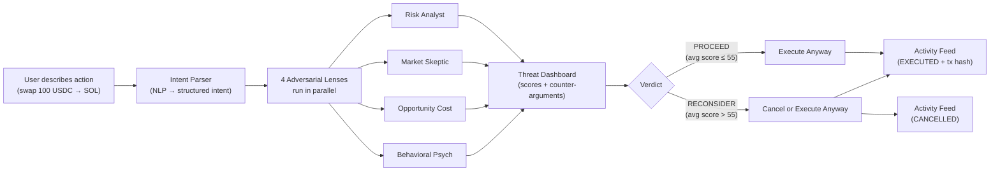
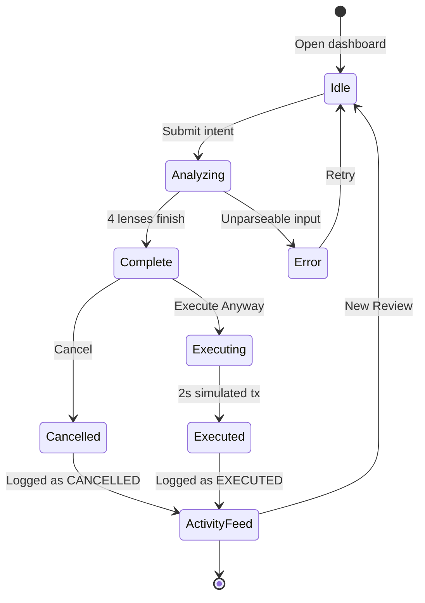
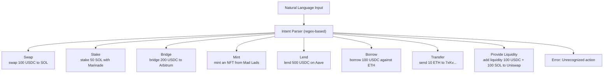
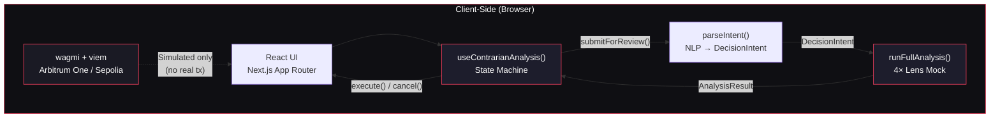

<div align="center">

# Contrarian

**The AI Agent That Challenges Every Onchain Decision Before It Becomes a Transaction**

[](https://nextjs.org/)
[](https://react.dev/)
[](https://www.typescriptlang.org/)
[](https://tailwindcss.com/)
[](./LICENSE)

[Launch App](/#) · [Documentation](/#docs) · [Report Bug](https://github.com/nicokd/contrarian/issues) · [Request Feature](https://github.com/nicokd/contrarian/issues)

</div>

---

## Problem

Humans are biased. In crypto, the pattern is always the same:

```
FOMO                → Swap   → Loss
Influencer Tweet    → Buy    → Loss
Panic               → Sell   → Market Rebound
```

But the deeper problem isn't just bias — **it's information blindness at the moment of action.**

When a user is about to execute an onchain transaction, they almost never have the full picture:

| What the user sees | What they don't see |
|--------------------|---------------------|
| "Swap 100 USDC → SOL" | Gas fee is 5× higher than usual due to network congestion |
| The confirm button | Liquidity pool depth is below $50K — their order will move the price against them |
| A token that's up 30% today | It's up 340% in 24 hours — classic pump pattern, likely to dump |
| A DeFi protocol offering 80% APY | The contract is unaudited and the yield is funded by inflationary emissions |
| A staking option | A better-yielding validator is available with zero commission |

Wallets ask *"Confirm?"* — but nobody asks *"Are you sure, and here's why you might not be?"*

There is no system that actively argues **against** a user's decision before it executes onchain. The moment you sign, it's final. Irreversible. And most users only find out the risks after the money has already moved.

## Solution

Contrarian is a **Decision Firewall for Onchain Actions**.

Instead of helping users confirm decisions, Contrarian actively searches for reasons why they may be wrong. It deploys **4 adversarial review lenses** against every transaction intent, scores each for concern, and presents the strongest case against following through. Then — and only then — it hands the user the button.

Contrarian is not an advisor. Contrarian is not a copilot. **Contrarian is a Red Team Agent.**

---

## How It Works



1. **Describe** — Type an onchain action in plain English (e.g., `swap 500 USDC to PEPE`)
2. **Get Argued With** — Four adversarial lenses score the decision 0–100 and construct counter-arguments
3. **Decide** — Choose **Execute Anyway** or **Cancel** — the call is always yours

---

## The Four Lenses

| Lens | Question | What It Checks |
|------|----------|---------------|
| **Risk Analyst** | *What breaks?* | Downside risks: thin liquidity, unaudited contracts, slippage, depeg history |
| **Market Skeptic** | *Why now?* | FOMO signals: pump patterns, social spikes, influencer shills, manufactured urgency |
| **Opportunity Cost** | *What instead?* | Better alternatives: higher yields, cheaper routes, smaller tranches, or simply waiting |
| **Behavioral Psych** | *Why you?* | Your patterns: revenge trades, leverage spirals, 2am mints, emotional decisions |

### Scoring

| Score | Severity |
|-------|----------|
| 0–39  | Low — Acceptable |
| 40–69 | Medium — Review advised |
| 70–100 | High — Critical attention required |

The verdict is derived from the average of the four scores: **above 55** → `RECONSIDER`, **at or below** → `PROCEED WITH CAUTION`. There is no hard block — the final decision is always yours.

---

## Review Lifecycle



| State | Description |
|-------|-------------|
| **Idle** | Hero landing with prompt bar — waiting for user input |
| **Analyzing** | Four lenses running in parallel; shows loading state |
| **Complete** | Scores, counter-arguments, and verdict rendered; waiting for user decision |
| **Executing** | Simulated transaction in progress (2s delay) |
| **Executed** | Transaction "confirmed" — mock hash appended to activity feed |
| **Error** | Input could not be parsed into a known action type |
| **Cancelled** | Review removed from transcript; logged as a win in activity feed |

---

## Supported Actions



| Action | Example Prompt | Parsed Fields |
|--------|---------------|---------------|
| Swap | `swap 100 USDC to SOL` | amount, from, to |
| Stake | `stake 50 SOL with Marinade` | amount, token, protocol |
| Bridge | `bridge 200 USDC to Arbitrum` | amount, token, destination |
| Mint | `mint an NFT from Mad Lads` | collection |
| Lend | `lend 500 USDC on Aave` | amount, token, protocol |
| Borrow | `borrow 100 USDC against ETH` | amount, token, collateral |
| Transfer | `send 10 ETH to 7xKv...` | amount, token, recipient |
| Provide Liquidity | `add liquidity 100 USDC + 100 SOL to Uniswap` | pair amounts, protocol |

---

## Project Structure

```mermaid
graph TD
    Root["contrarian/"] --> AppDir["app/"]
    Root --> CompDir["components/"]
    Root --> HooksDir["hooks/"]
    Root --> LibDir["lib/"]

    AppDir --> Layout["layout.tsx<br/>Root layout + fonts + dark mode"]
    AppDir --> Providers["providers.tsx<br/>wagmi + React Query"]
    AppDir --> LandingPage["page.tsx<br/>Marketing landing page"]
    AppDir --> DocsPage["docs/page.tsx<br/>Documentation with TOC"]
    AppDir --> DashboardPage["dashboard/page.tsx<br/>The app experience"]
    AppDir --> DashboardLayout["dashboard/layout.tsx"]
    AppDir --> GlobalsCSS["globals.css<br/>Theme tokens + Tailwind v4"]

    CompDir --> Orb["orb.tsx<br/>Animated rose/red sphere"]
    CompDir --> Hero["hero.tsx<br/>Idle landing (orb + prompt)"]
    CompDir --> PromptBar["prompt-bar.tsx<br/>Shared input component"]
    CompDir --> ChatInt["chat-interface.tsx<br/>Conversation + phase cards"]
    CompDir --> Verdict["verdict-panel.tsx<br/>Execute / Cancel actions"]
    CompDir --> ScoreGauge["score-gauge.tsx<br/>Animated SVG arc gauge"]
    CompDir --> CounterArgs["counter-arguments.tsx<br/>Numbered objection list"]
    CompDir --> ActivityFeed["activity-feed.tsx<br/>Review history sidebar"]
    CompDir --> WalletBtn["wallet-button.tsx<br/>wagmi connect/switch"]
    CompDir --> SiteChrome["site-header.tsx<br/>site-footer.tsx<br/>brand-mark.tsx"]
    CompDir --> UI["ui/<br/>shadcn primitives"]

    HooksDir --> UseAnalysis["use-contrarian-analysis.ts<br/>State machine for review lifecycle"]

    LibDir --> MockAnalysis["mock-analysis.ts<br/>Intent parser + mock lens engine"]
    LibDir --> WagmiConfig["wagmi.ts<br/>Arbitrum config"]
    LibDir --> Utils["utils.ts<br/>cn() helper"]
```



---

## Architecture



Key architectural decisions:

- **No server state** — everything runs client-side; the "AI" is a deterministic mock
- **State machine pattern** — `useContrarianAnalysis()` hook drives the entire review lifecycle with 3 pieces of state: `messages`, `history`, `isProcessing`
- **Component-per-responsibility** — each UI concern (chat, scores, verdict, feed) is its own component
- **Simulated execution** — wallet connection is real (wagmi on Arbitrum), but transactions are mocked with fake hashes

---

## Tech Stack

| Technology | Purpose |
|-----------|---------|
| **Next.js 16** | App Router, React 19, server + client components |
| **React 19** | UI rendering |
| **TypeScript 5** | Type safety |
| **Tailwind CSS v4** | Config-less styling via CSS variables and `@theme` |
| **shadcn/ui** (base-nova) | Accessible UI primitives built on `@base-ui/react` |
| **Framer Motion** | Page transitions, score gauges, orb animation |
| **wagmi + viem** | Wallet connection on Arbitrum One / Sepolia |
| **@tanstack/react-query** | Async state (required by wagmi) |
| **Lucide React** | Icons |

---

## Getting Started

### Prerequisites

- **Node.js** 18.17+
- **npm** 9+

### Installation

```bash
# Clone the repository
git clone https://github.com/nicokd/contrarian.git
cd contrarian

# Install dependencies
npm install

# Start the development server
npm run dev
```

Open [http://localhost:3000](http://localhost:3000) to see the landing page.

Open [http://localhost:3000/dashboard](http://localhost:3000/dashboard) to try the app.

### Other Commands

```bash
npm run build    # Production build
npm run start    # Start production server
npm run lint     # Run ESLint
```

---

## Design System

| Token | Value | Usage |
|-------|-------|-------|
| Background | `#09090b` | App background |
| Foreground | `#fafafa` | Primary text |
| Card | `#0f0f13` | Surface cards |
| Border | `rgba(255,255,255,0.06)` | Subtle dividers |
| Rose | `#f43f5e` | Accent / danger / brand |
| Font (sans) | Geist | Prose body text |
| Font (mono) | Geist Mono | Labels, scores, addresses, numbers |

- **Dark only** — the app enforces `<html class="dark">`
- **Motion** follows duration tiers: micro (100ms), short (150ms), medium (200–250ms), long (300–400ms), cap 500ms
- **Accessibility** — real buttons/links, visible focus rings, ≥40px hit targets, AA contrast, `prefers-reduced-motion` respected

---

## Important Notes

> **Demo Build** — Analysis is mocked locally (deterministic phrase pools + weighted random scores, no LLM). Execution is simulated (fake tx hashes, nothing signed or broadcast). History resets on reload.

> **Next.js 16** — This project uses Next.js 16 with breaking changes. Consult `node_modules/next/dist/docs/` before using any Next.js API.

---

## Roadmap

- [ ] Replace mock analysis with real LLM call (four-persona prompt → structured output)
- [ ] Real transaction construction + simulation before signing
- [ ] Persistent review history (localStorage → backend)
- [ ] Per-lens detail drill-down (expand a gauge to read `details[]`)
- [ ] Streaming lens results (render each persona as it finishes)
- [ ] Keyboard shortcuts (⌘K to focus prompt, Esc to cancel)
- [ ] Responsive design for mobile & tablet
- [ ] Light mode support
- [ ] Component tests for state machine and intent parser

---

## License

MIT © Contrarian

---

<div align="center">

**Every transaction deserves an argument.**

</div>